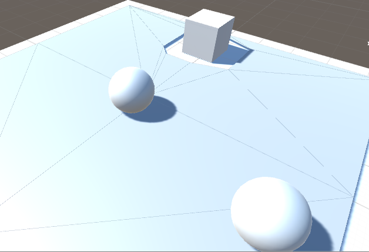
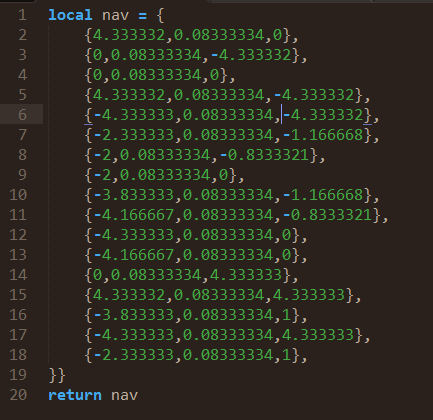

Navmesh数据导出工具
====

-------  
### 说明
unity自带的navmesh由于算法没公开，服务端要判断该移动点是否合法比较困难，很多时候需要自己实现一套A*费时费力，
本工具就是导出navmesh的各个三角形坐标数据，然后服务端只需要判断该点是否在三角形内就为之合法。 

### 如何使用
1.首先你需要自己在unity里编辑好可行走范围 
2.然后点击菜单Tools/Export NavMesh Data即可 

### 如何测试
1.首先把navmesh目录下生成的mesh拖进场景 
2.然后点击菜单Tools/NavMesh Data Test即可 (如果要修改检测点坐标 请在代码修改checkPoint监测点) 

联系
-------
qq342854406  qq群347085657
